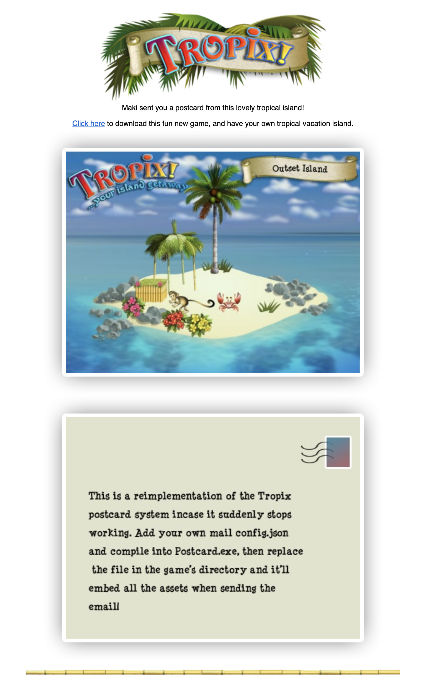

# Tropix Postcard Reimplemented

I originally tested this on macOS whilst playing Tropix using CrossOver. Because Go can cross compile, I had no problems at all.

To compile yourself:

-   Copy `config.example.json` to `config.json` and enter your email credentials
-   Run `build.sh` or `build.bat` and it'll compile `Postcard.exe`
-   Rename `C:\Program Files (x86)\Tropix\Postcard.exe` to `Postcard.exe.old`
-   Move your newly compiled `Postcard.exe` to the Tropix directory

You can also test it first by running:

`go run Postcard.go _ _ _ email@example.com Name html/tropixTitle.jpg html/tropixTitle.jpg`

The last two arguments are usually temporary paths to the front and back postcard images that the game generates.

